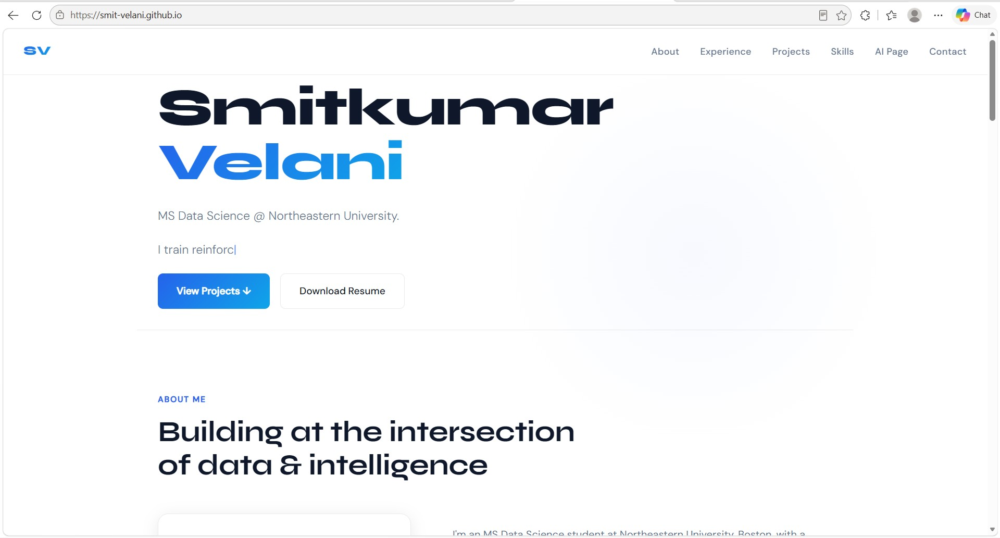

# 🌐 Smitkumar Velani — Personal Portfolio

> A personal portfolio website built with vanilla HTML5, CSS3, and ES6+ JavaScript. Designed to showcase projects, skills, and experience to potential employers and recruiters in the Data Science field.

[](https://smit-velani.github.io)
[](https://smit-velani.github.io/ai-page.html)
[](https://github.com/Smit-Velani)
[](https://www.linkedin.com/in/smit-velani)

---

## 👤 Author

**Smitkumar Jayendrakumar Velani**
MS Data Science — Northeastern University, Boston, MA
📧 velanismitkumar@gmail.com

---

## 🎓 Class

**CS5610 — Web Development**
Khoury College of Computer Sciences, Northeastern University
🔗 [Course Page](https://northeastern.instructure.com/courses/249954)

---

## 🎯 Project Objective

Build a professional personal portfolio website using only vanilla HTML5, CSS3, and ES6+ JavaScript — no frameworks, no component libraries, no jQuery. The site showcases my academic background, technical skills, work experience, and Data Science projects to potential employers and recruiters.

The portfolio includes:
- 🏠 **[Home Page](https://smit-velani.github.io)** — Hero with typewriter animation, About, Experience, Projects preview, Skills, Contact
- 📁 **[Projects Page](https://smit-velani.github.io/projects.html)** — Full detailed descriptions of all 5 ML/AI projects
- 🤖 **[AI-Generated Page](https://smit-velani.github.io/ai-page.html)** — The Future of Data Science, generated with Claude AI

---

## 📸 Screenshot



> Live at: **https://smit-velani.github.io**

---

## 🗂️ Project Structure

```
smit-velani.github.io/
├── 📄 index.html                          # Main home page
├── 📄 projects.html                       # Detailed projects page
├── 📄 ai-page.html                        # AI-generated page
├── 📁 css/
│   └── style.css                          # All styles
├── 📁 js/
│   └── main.js                            # ES6 module — typewriter + interactions
├── 📁 images/
│   └── photo.PNG                          # Profile photo
├── 📄 resume.pdf                          # Downloadable resume
├── 📄 Design_Document_Smit_Velani.docx    # Design document
├── 📄 package.json                        # Project dependencies
├── 📄 .eslintrc.json                      # ESLint configuration
├── 📄 LICENSE                             # MIT License
└── 📄 README.md                           # This file
```

---

## ✨ Features

- ⚡ **Zero dependencies** — pure vanilla HTML5, CSS3, ES6+
- 🎨 **Typewriter animation** — original JS functionality cycling through phrases
- 📱 **Fully responsive** — works on desktop, tablet, and mobile
- 🔍 **W3C compliant** — passes HTML validation with no errors
- ♿ **Accessible** — semantic HTML, alt tags, proper contrast
- 🚀 **Fast** — no backend, no frameworks, deployed on GitHub Pages
- 📦 **ES6 modules** — JavaScript organized with `type="module"`

---

## 🛠️ Instructions to Build

### Prerequisites
- [Node.js](https://nodejs.org/) (v18 or higher)
- [npm](https://www.npmjs.com/)

### Installation

```bash
# Clone the repository
git clone https://github.com/Smit-Velani/smit-velani.github.io.git

# Navigate into the project
cd smit-velani.github.io

# Install dependencies
npm install
```

### Running Locally

```bash
# Option 1: Open directly in browser
open index.html

# Option 2: Use a local server (recommended)
npx serve .

# Option 3: Use VS Code Live Server extension
# Right-click index.html → Open with Live Server
```

### Linting

```bash
# Run ESLint
npx eslint js/main.js

# Format with Prettier
npx prettier --write .
```

---

## 🤖 GenAI Tools

This project used **Generative AI** in the following ways:

| Tool | Version | Usage |
|------|---------|-------|
| Claude | claude-sonnet-4-6 (Anthropic) | Design document writing, ai-page.html content generation, README structure |

### Details

**Model used:** Claude Sonnet 4.6 by Anthropic

**How it was used:**
- **Design Document** — Claude was used to help structure the design document including user personas, user stories, and wireframe descriptions. All technical decisions and project details are my own.
- **ai-page.html** — The content on the AI-generated page was generated using Claude with the prompt: *"Write an educational article about the future of Data Science covering current trends in LLMs, AutoML, MLOps, skills needed in 2025 and beyond, and career opportunities."*
- **README** — Claude assisted in structuring this README file. All project-specific details, links, and descriptions are my own.

**What was NOT AI generated:**
- All HTML, CSS, and JavaScript code
- Project descriptions and technical achievements
- Design decisions and visual layout

---

## 📋 Rubric Checklist

| Requirement | Status |
|-------------|--------|
| Design Document | ✅ |
| Good homepage with meaningful info | ✅ |
| ES6 modules (`type="module"`) | ✅ |
| Deployed on public page | ✅ |
| Original creative component | ✅ Typewriter animation |
| CSS/JS/Images in separate folders | ✅ |
| Meta tags (author, description, icon) | ✅ |
| Original JS functionality (5+ lines) | ✅ |
| Prettier formatted | ✅ |
| W3C compliant | ✅ |
| ESLint config | ✅ |
| All images have alt values | ✅ |
| 2 HTML pages + AI generated page | ✅ |
| CSS classes used | ✅ |
| Standard HTML tags used | ✅ |
| Clean CSS without !important | ✅ |
| Grid or Flexbox | ✅ |
| README with all required sections | ✅ |
| package.json | ✅ |
| MIT License | ✅ |
| Demo video | ✅ |
| GenAI description | ✅ |

---

## 📄 License

This project is licensed under the **MIT License** — see the [LICENSE](https://github.com/Smit-Velani/smit-velani.github.io/blob/main/LICENSE) file for details.

---

<p align="center">
  Designed & built by <strong>Smitkumar Jayendrakumar Velani</strong> · Boston, MA
</p>
